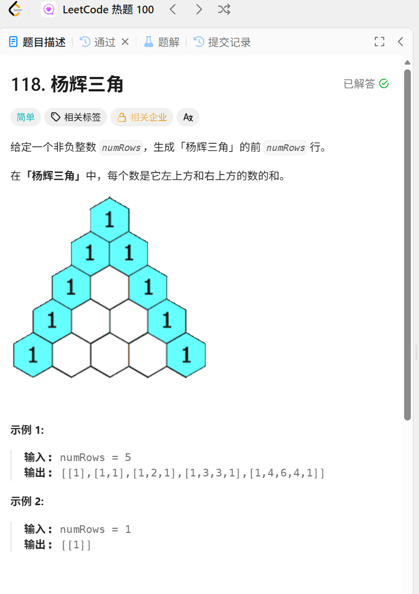

这个杨辉三角也是非常出名呀,从小学考到大学


好的,让我们来看这道题
乍一看,我心里萌生了一个暴力解法,就是一层一层遍历,这道题确实也只能一层一层写

我们来看看他的示例,我本来想到的是用切片,结果用切片类型的切片,但是我猛一下没想到该怎么定义,然后问了下ai,发现有二维切片这个说法(Σ(⊙▽⊙"a学到了)
然后题目说是 每个数是他左上方和右上方的数的和
假设当前数的索引为 i,我们观察一下图,不难看出,除去两边的,中间的数由上一行 索引为 i-1 和 i 的数组成

有了这个概念,就好写一点了
就是一行一行遍历,(这里要记住,每一行需要单独初始化)
对于中间的数,要二次循环,从第二位开始,也就是索引为1的位置开始

```go
func generate(numRows int) [][]int {
    // 每个数,由他的上一行中,行号-1和行号
    // 比如 2是1和2,3是2和3

    // 切片类型的切片,二维切片
    result := make([][]int,numRows)

    for i := 0;i < numRows ; i++{
        // 先初始化
        result[i] = make([]int,i+1)
        if i == 0{
            result[i] = []int{1}
        }else{
            result[i][0] = 1
            result[i][i] = 1
            // 从第二个数开始算
            for j := 1;j<i;j++{
                result[i][j] = result[i-1][j-1]+result[i-1][j]
            }
        }
    }
    return result
}
```