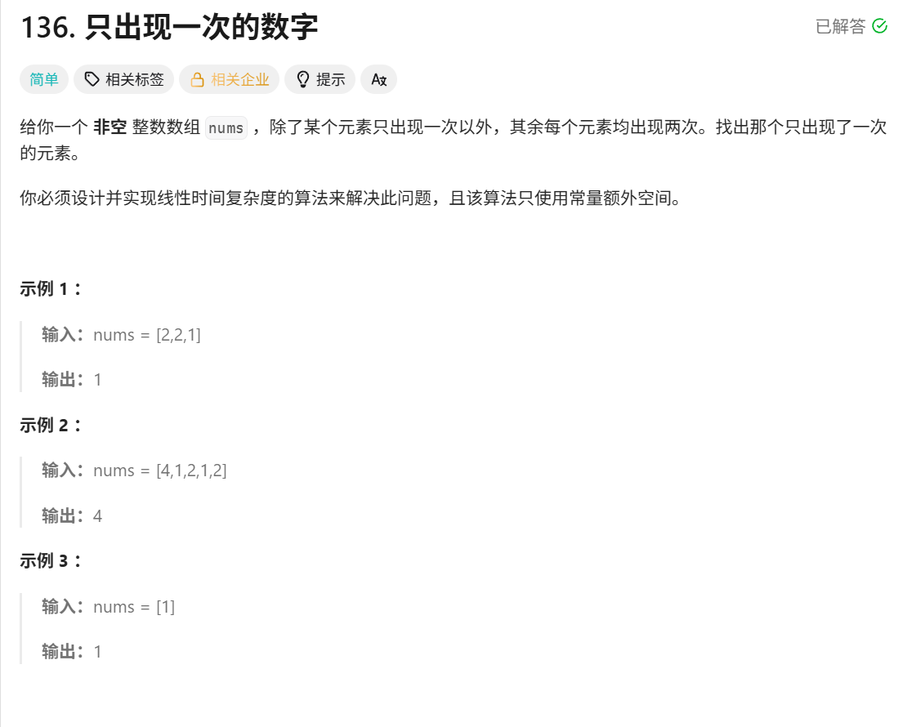

这道题呀,标上了简单
我们来看一看,找只出现一次的数字,其余的元素只出现两次


首先能想到的做法呢,就是遍历之后放入map,也是试了一下,结果如下
```go
func singleNumber(nums []int) int {
    // 长度不变--> map?
    result :=  make(map[int]int,len(nums))

    for _,v := range nums{
        result[v]++
    }
    // 遍历过一遍之后
    for k1,v1 := range result {
        if v1 ==1 {
            return k1
        }
    }
    return 0
}
```
! 居然超过了 2.63% 的选手😓


我们再重新看看这道题
这道题被分到了leetcode hot100的技巧中
题目描述中说:你必须设计并实现限行时间复杂度的算法来解决此问题,且该算法只使用常量额外空间

我们原来使用的map,他的空间复杂度是 O(n)
但是官方要求的常量额外空间是: O(1) + O(n),也就是不能使用map/数组/栈等会随输入变大的空间
(😭我本来以为只要定义的时候设置好容量就行了,但是长度是变化的)
规范的解法就是 位运算中的异或运算

大家想想计组(😱想起来我们老师我就害怕,老师当时就提问最后一排,然后下午的课,大家上午上完课不吃饭先去占座位)
好了,在计组中,最常见的数字就是0和1
想想异或运算
1. 任何数和 0 做异或运算，结果仍然是原来的数，即 a⊕0=a。 
2. 任何数和其自身做异或运算，结果是 0，即 a⊕a=0。 
3. 异或运算满足交换律和结合律，即 a⊕b⊕a=b⊕a⊕a=b⊕(a⊕a)=b⊕0=b。

这样是不是就有思路了,因为要参加蓝桥杯,所以下面代码就用java写了
```java
class Solution {
    public int singleNumber(int[] nums) {
        int flag = 0;
        for( int num: nums){
            flag ^= num;
        }
        return flag
    }
}
```
这里怎么理解呢,a⊕b⊕a=b⊕a⊕a=b⊕(a⊕a)=b⊕0=b,看着一条,计算不了的写成一个式子,然后后面慢慢消
