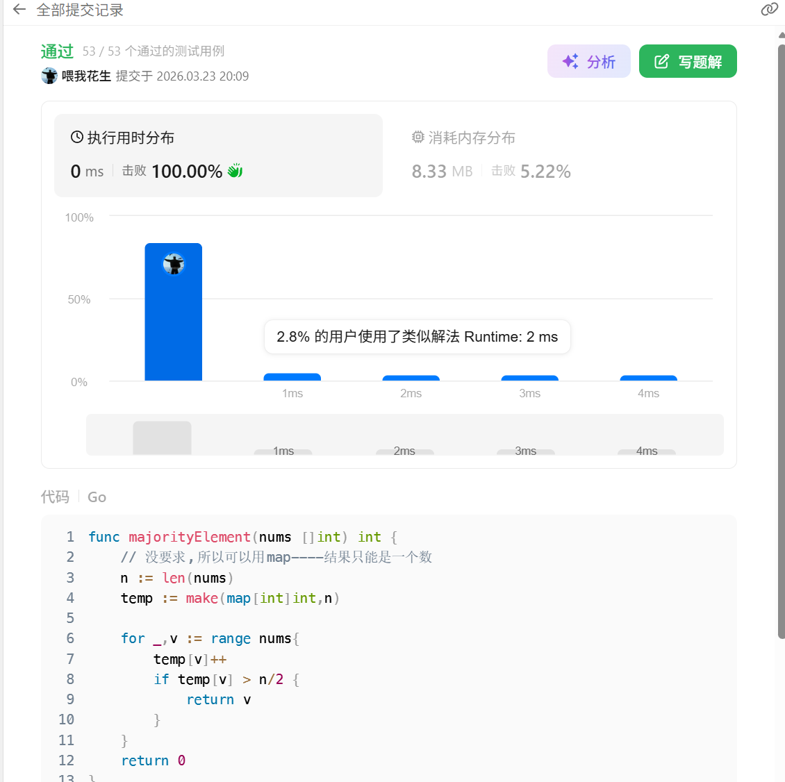

话不多说,map直接秒了
```go
func majorityElement(nums []int) int {
    // 没要求,所以可以用map----结果只能是一个数
    n := len(nums)
    temp := make(map[int]int,n)

    for _,v := range nums{
        temp[v]++
        if temp[v] > n/2 {
            return v
        }
    }
    return 0
}
```
