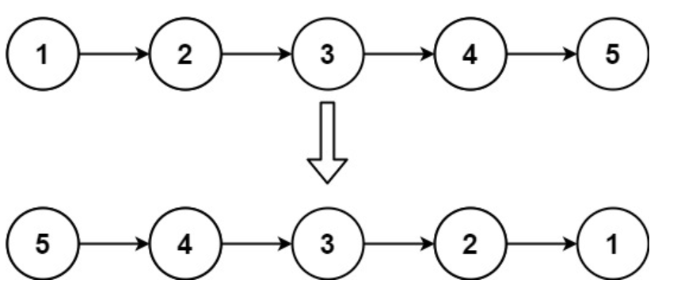

这道题是链表的一个入门题,是后面很多题的基础,如果做到后面的链表题没有思路的时候,不妨来看看这道题


首先,要想把链表翻转过来,我们先看其中一段,就看第一段,我们需要把1->2断开
这里我们想想以前所写的交换,需要一个临时变量temp
```go
func swap(a,b int)(int,int){
	temp := a
	a = b
	b = a
	return a,b
}

```
这里也是同理,我们写一个temp作为中转站
```go
func reverseList(head *ListNode) *ListNode(){
	current := head
	var result *ListNode
	
	for current != nil{
		// 首先要取出来
		temp := current.Next
		current.Next = result
		// 这里result 就相当于 current.Next
		
		// 先交换,再移动指针
        result = current
		
		current = temp
    }
	return result
}
```

看完你可能有点疑惑,没事我们来翻译一下这段for循环

首先for循环的条件,current != nil
有两种情况这里会跳出循环
1. 链表为空
2. 链表结束

然后的话
`temp := current.Next`取出current.Next的下一个节点

然后的话,`current.Next = result` 就是让链表的头反过来,你想呀,是1->2,调整完是 1->nil,相当于变相反回来

然后`result = current`挪动指针,这时候是为了下一次循环做准备,然pre成为下一个箭头翻转过来要指向的目标
最后才完成交换

测试结果如下


