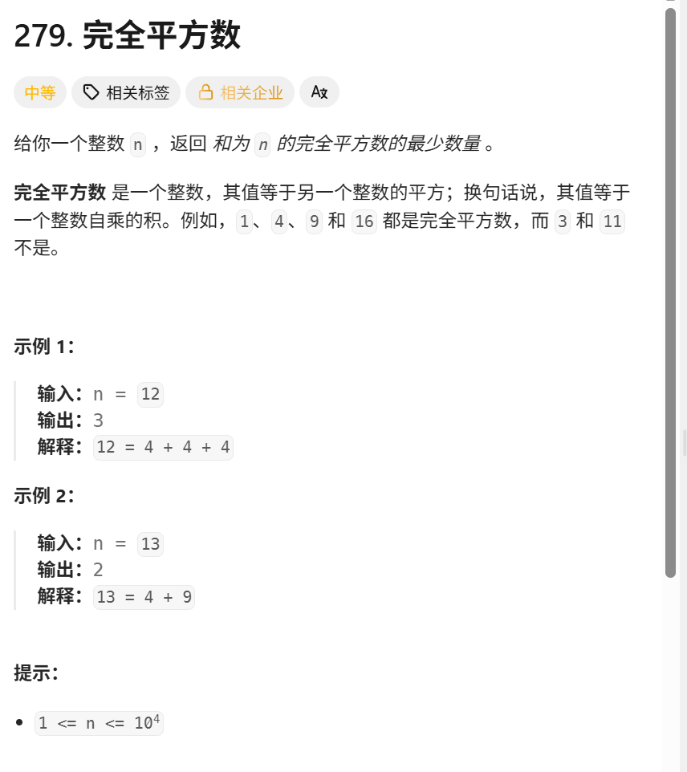

这道题首先能想到的就是,从最大数开始遍历,从大数开始找,题目上说 返回和为n的完全平方数的最小数量
仔细想想,这真的是优化了dp问题吗
其实这样想是贪心的思想,保证拿到的数是最大数,但是这样就能保证,数量最小吗,我们举个例子来看
n=12
如果选择贪心,最大平方数=9,12-9=3,3=1+1+1,需要4个数
但是正确答案是 12=4+4+4

在这里局部最优 并不等于 全局最优

所以不是选最大的平方数,而是尝试所有平方数路径,取最短的一条

```go
func numSquares(n int) int {
    f := make([]int,n+1)

    for i:=1;i<=n;i++{
        minum := i
        for j:=1;j*j<=i;j++{
            minum = min(minum,f[i-j*j])
        }
        f[i] = minum+1
	}
    return f[n]
}
func min(a,b int)int{
    if a<b{
        return a
    }
    return b
}


```


