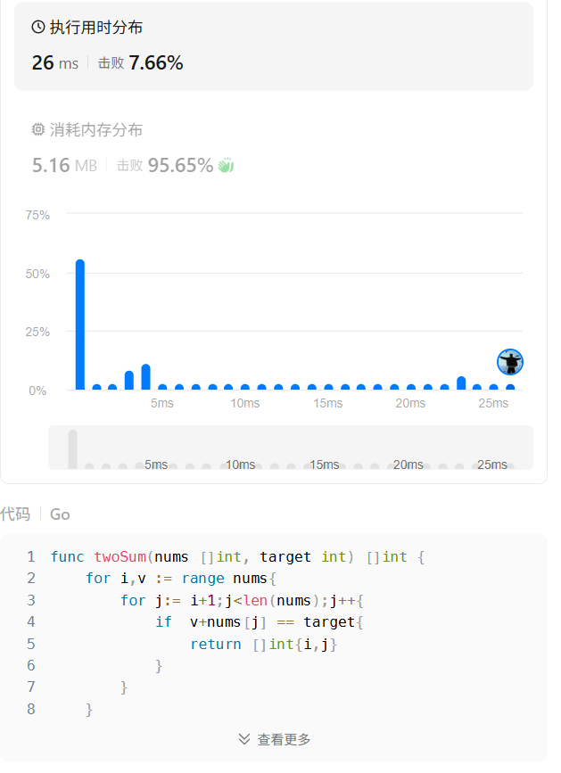

# 第一题两数之和

这道题求两数之和,那么这个给定数组就需要遍历两边
又说了不能使用两次重复元素,所以这里有一次循环需要一点点条件

## 方法一:蛮力法
```go
func twoSum(nums []int, target int) []int {
    for i,v := range nums{
        for j:= i+1;j<len(nums);j++{
            if  v+nums[j] == target{
                return []int{i,j}
            } 
        }
    }
    return nil
}
```
也是勉强通过了


这个时候时间复杂度是O(n)对不对,执行用时也是非常的慢,这里有没有更快的解决方法呢,答案是有的,
接下来我们思考一下用一个循环怎么样来解决
咱们之所以多使用了一个循环,是因为第二遍循环是来找 target-i 的,咱们想想,map中是不是有一个数据结构的一个方法,可以很轻松的查找该数据结构中,有没有一个key为...的value

## 方法二:哈希表
说到这里,大家可能已经知道是什么了,没错,就是我们的map
`v,ok := m[10]`,这个地方如果想用map,就需要key为原来切片的值,value为原来切片的序列
代码示例如下:
```go
func twoSum(nums []int, target int) []int {
    hashmap := map[int]int{}
    for i,_ := range nums{
        if res,ok := hashmap[target-nums[i]];ok{
            return []int{res,i}
        }
        hashmap[nums[i]] = i
    }
    return nil
}
```

